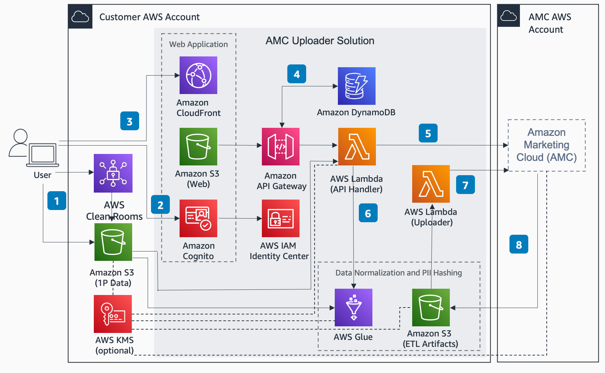
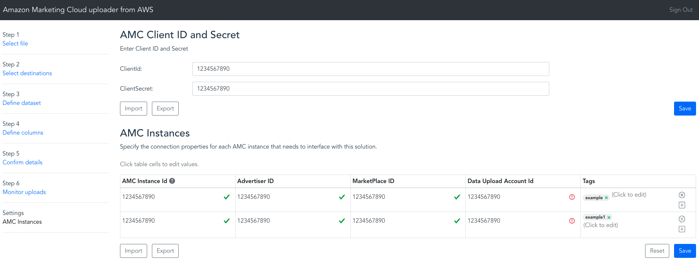

# Amazon Marketing Cloud (AMC) Uploader from AWS

This solution enables users to upload first party datasets from Amazon S3 into the Amazon Marketing Cloud (AMC). It includes a web application in which users are guided through the process of defining datasets and their PII attributes. Once this information is submitted, the solution initiates an ETL workflow that performs data normalization, hashing of plain-text PII, time-series partitioning, and upload to AMC.

## Architecture



The architecture diagram for this solution is shown above. The process flow is described below:

1. User uploads first party data to designated Amazon S3 Bucket or exports data from AWS Clean Rooms to Amazon S3 Bucket
2. User uses Amazon Cognito to log into AMC Uploader web application using AWS IAM
3. Users can configure multiple AMC instances within the AMC Uploader web interface.  This information is stored in Amazon DynamoDB
4. Within the AMC Uploader web application, user will select the data they wish to upload to AMC.  The user will be able to select file from the Amazon S3 bucket that was set when the AWS CloudFormation stack was created.  The user will map the columns in the file to a schema compatible with AMC
5. Once the schema has been set up within the AMC Uploader web application, it will create the dataset within the AMC instance via Amazon API Gateway and AWS Lambda
6. The data will be normalized using AWS Glue and the relevant PII columns will be hashed according to AMC Guidelines
7. An API call will be made to the AMC API using AWS Lambda after the AWS Glue job has been completed using an S3 Event Notification
8. AMC will extract the transformed data from the ETL Artifacts Amazon S3 bucket for upload into the advertiser’s AMC instance asynchronously.

If first-party data files have been encrypted using KMS, then users must specify which KMS key can be used to decrypt them. The CloudFormation parameter called "CustomerManagedKey" is provided for this purpose (see [below](#input)).

The dotted lines leading from the KMS key object in the architecture diagram indicate where this key is used for decryption. When users specify a KMS key, that key will be used to encrypt or decrypt data wherever it is saved or read from disk throughout the ETL pipeline, as described below:

* The Lambda function for the /get_data_columns API resource decrypts input files with the user-specified KMS key in order to render the web form in which users define dataset schemas.
* The Glue job decrypts input files with the user-specified KMS key in order to apply data transformations.
* The ETL Artifact Bucket performs server-side encryption to every object with the user-specified KMS key, or with a default key is none is provided.
* AMC encrypts datasets with the user-specified KMS key or with a default key is none is provided.

### User Interface:




## INSTALLATION

The following Cloudformation templates will deploy the application.

Region| Launch
------|-----
US East (N. Virginia) | [](https://console.aws.amazon.com/cloudformation/home?region=us-east-1#/stacks/new?stackName=amcufa&templateURL=https://solutions-reference.s3.amazonaws.com/amazon-marketing-cloud-uploader-from-aws/v2.1.1/amazon-marketing-cloud-uploader-from-aws.template)
EU West (Ireland) | [](https://console.aws.amazon.com/cloudformation/home?region=eu-west-1#/stacks/new?stackName=amcufa&templateURL=https://solutions-reference.s3.amazonaws.com/amazon-marketing-cloud-uploader-from-aws/v2.1.1/amazon-marketing-cloud-uploader-from-aws.template)

Once the Cloud Formation stack has been created, open the URL shown in the `UserInterface` output of the base stack. You can also get this URL with the following AWS CLI command:

```
aws cloudformation --region $REGION describe-stacks --stack-name $STACK_NAME --query "Stacks[0].Outputs[?OutputKey=='UserInterface'].OutputValue" --output text
```

For more installation options, see the [Advanced Installation](#advanced-installation-options) section.

## INPUT

* *Stack name:* Required by AWS CloudFormation, this must be all lowercase. 
* *AdminEmail:* Email address of the administrator
* *DataBucketName:* Name of the S3 bucket from which source data will be uploaded.
* *CustomerManagedKey:* (Optional) Customer Managed Key to be used for decrypting source data, encrypting ETL results, and encrypting the corresponding datasets in AMC

  * AMC provides the ability to encrypt customer datasets with encryption keys created in AWS Key Management Service (KMS). This step is optional. If an encryption key is not provided, AMC will perform default encryption on behalf of the customer. The benefit to using a customer generated encryption key is the ability to revoke AMC’s access to uploaded data at any point. In addition, customers can monitor encryption key access via AWS CloudTrail event logs.
  * To enable this feature, specify a key in the *CustomerManagedKey* CloudFormation parameter and modify the key's policy to grant usage permissions to the AMC instance, as described in the "KMS Encryption Key Usage" section of the AMC Data Upload documentation.

# Advanced Installation Options

## Building the solution from source code

The following commands will build the solution from source code.

```
EMAIL=[specify your email]
STACK_NAME=[specify a lowercase stack name]
REGION=[specify a region]
VERSION=0.0.0
PROFILE=default
git clone https://github.com/aws-solutions/amazon-marketing-cloud-uploader-from-aws
cd amazon-marketing-cloud-uploader-from-aws/deployment
DATETIME=$(date '+%s')
DIST_OUTPUT_BUCKET=amcufa-$DATETIME-dist
TEMPLATE_OUTPUT_BUCKET=amcufa-$DATETIME
aws s3 mb s3://$DIST_OUTPUT_BUCKET-$REGION --region $REGION
aws s3 mb s3://$TEMPLATE_OUTPUT_BUCKET --region $REGION
./build-s3-dist.sh --template-bucket ${TEMPLATE_OUTPUT_BUCKET} --code-bucket ${DIST_OUTPUT_BUCKET} --solution-name ${STACK_NAME} --version ${VERSION} --region ${REGION} --profile ${PROFILE} | tee >( grep TEMPLATE >template )
TEMPLATE=$(cat template | cut -f 2 -d "'")
```

Once you have built the demo app with the above commands, then it's time to deploy it.

#### Deploy

Use these commands to deploy the application in AWS CloudFormation:

```
TEMPLATE=[copy link shown at the end of the build script]
STACK_NAME=[arbitrary stack name]
EMAIL=[Email address to receive credentials for webapp]
SOURCE_BUCKET=[Name of the S3 bucket from which source data will be uploaded.]
CUSTOMER_MANAGED_KEY=[(Optional) Customer Managed Key to be used for encryption]
PROFILE=[AWS profile for the AWS account that is connected to your AMC instance]

aws cloudformation create-stack --stack-name $STACK_NAME --template-url $TEMPLATE --region $REGION --parameters ParameterKey=AdminEmail,ParameterValue=$EMAIL ParameterKey=DataBucketName,ParameterValue=$SOURCE_BUCKET ParameterKey=CustomerManagedKey,ParameterValue=$CUSTOMER_MANAGED_KEY --capabilities CAPABILITY_IAM CAPABILITY_NAMED_IAM CAPABILITY_AUTO_EXPAND --profile $PROFILE --disable-rollback
```

# User Authentication

This solution uses [Amazon Cognito](https://docs.aws.amazon.com/cognito/index.html) for user authentication. When a user logs into the web application, Cognito provides temporary tokens that front-end Javascript components use to authenticate to back-end APIs in API Gateway and Elasticsearch. To learn more about these tokens, see [Using Tokens with User Pools](https://docs.aws.amazon.com/cognito/latest/developerguide/amazon-cognito-user-pools-using-tokens-with-identity-providers.html) in the Amazon Cognito documentation.

The front-end Javascript components in this application use the [Amplify Framework](https://docs.amplify.aws/) to perform back-end requests. You won't actually see any explicit handling of Cognito tokens in the source code for this application because that's all handled internally by the Amplify Framework.

## User account management

All the necessary Cognito resources for this solution are configured in the [deployment/auth.yaml](deployment/auth.yaml) CloudFormation template and it includes an initial administration account. A temporary password for this account will be sent to the email address specified during the CloudFormation deployment. This administration account can be used to create additional user accounts for the application.

Follow this procedure to create new user accounts:

1.	Sign in to the [Amazon Cognito console](https://console.aws.amazon.com/cognito/home).
2.	Choose Manage User Pools.
3.	In the User Pools page, select the user pool for your stack.
4.	From the left navigation pane, choose Users and Groups.
5.	On the Users tab, choose Create user.


6.	In the Create user dialog box, enter a username and temporary password.
7.	Choose Create user.
8.	On the User Pool page, under the Username column, select the user you just created.


9.	On the Users page, choose Add to group.
10.	In the Add user dialog box, access the drop-down list and select the user group corresponding to your auth stack.


The new user will now be able to use the web application.

## Unit Tests
---

The following steps can be done to run the unit tests contained in the `tests` directory:

1. Open a terminal window and navigate to the root directory.
2. Run this command in the terminal:
```shell
sh deployment/run-unit-tests.sh
```
3. A new virtual environment should now be created with the script with test environment variables. The tests will also execute.
4. A coverage report will be generated for SonarQube and can be viewed in the `tests/coverage-reports` directory.

### Pre-Commit
---

```
./run-pre-commit.sh --help
```


## Collection of operational metrics

This solution collects anonymized operational metrics to help AWS improve the
quality of features of the solution. For more information, including how to disable
this capability, please see the [implementation guide](https://docs.aws.amazon.com/solutions/latest/amazon-marketing-cloud-uploader-from-aws/collection-of-operational-metrics.html).

---
# Advanced Usage

## Integration with solution for file upload automation

This solution's `start_amc_transformation` API endpoint can be integrated with other ETL pipelines to provide built-in normalization and time-series partitioning before uploading data to Amazon Marketing Cloud (AMC).

The purpose of the endpoint is to normalize and hash clear-text PII and partition time series data sets for AMC. Timestamp columns must be formatted before using the endpoint according to ISO 8601.

The `start_amc_transformation` API endpoint starts an AWS Glue Job with the arguments passed into it. The following is a summary of the arguments included in a request to the endpoint and expected outputs of the API:

### Inputs

- `countryCode`: string
	- The country code to be used for different country-specific normalizations to apply to all rows in the dataset
	- 2-digit ISO country code
  - The full list of supported country codes can be found in the solution's Implementation Guide
	- Ex: `"countryCode": "US"`

- `datasetId`: string
	- The name of the new data set that will be created with the data being uploaded
	- It can also be the name of an existing data set that the data will be uploaded to, though the schema should match (`deletedFields`, `piiFields`, and column names should be the same)
	- Ex: `"datasetId": "new-AMC-dataset"`

- `deletedFields`: string (array)
	- The list of columns to be deleted or dropped from the original data set prior to uploading to AMC
	- Ex: `"deletedFields": "[\"product_quantity\",\"product_name\"]"`

	- Can be an empty array string if no data needs to be deleted
	- Ex: `"deletedFields": "[]"`

- `destination_endpoints`: string (array)
	- The list of AMC endpoints to receive uploads
	- Ex: `destination_endpoints: "[\" https://rrhcd93zj3.execute-api.us-east-1.amazonaws.com/prod\"]"`

- `outputBucket`: string
	- The name of the ETL artifact S3 bucket where the normalized output data will be written to
	- Ex: `"outputBucket": "myTestStack-etl-artifacts"`,

- `period`: string
  - _Required_ for a `fact` data set
  - _Not used_ and should be omitted for a `dimension` data set
  - The time period of the data set
  - If a fact type data set, `autodetect` or a specific period can be selected
    - Ex: `"period": "autodetect"`
    - Ex: `"period": "PT1H"`
  - Options:  One of `["autodetect","PT1M","PT1H","P1D","P7D"]`

- `piiFields`: string (array)
	- A JSON formatted list of the names of PII columns to be normalized and hashed
	- Ex: `"piiFields": "[{\"column_name\":\"first_name\",\"pii_type\":\"FIRST_NAME\"},{\"column_name\":\"last_name\",\"pii_type\":\"LAST_NAME\"},{\"column_name\":\"email\",\"pii_type\":\"EMAIL\"}]"`

	- Can be an empty array string if no PII data is being uploaded
	- Ex: `"piiFields": "[]"`

- `sourceBucket`: string
	- The name of the S3 bucket where the `sourceKey` input data set is stored
	- Ex: `"sourceKey: "myTestBucket"`

- `sourceKey`: string
	- The S3 key of the data set to be normalized in the `sourceBucket`
	- Ex: `"sourceKey": "myTestData.json"`

- `timestampColumn`: string
  - _Required_ for a `fact` data set
  - _Not used_ and should be omitted for a `dimension` data set
	- Column name containing timestamps for the time series data sets
	- If the data set is going to be a fact type (time series), then a `timestampColumn` must be defined to be one of the data set's columns
	- Ex: `"timestampColumn": "timestamp"`

### Outputs
- Transformed data files in the user-specified `output_bucket` partitioned according to AMC spec
- JSON response with the `JobRunId`
- Ex: `"JobRunId": "jr_123123123123123123aaaaaaaaaa"`

## Using Postman

Postman can be used to send a request to the deployed instance's `start_amc_transformation` and begin a Glue job.

The instance's endpoint will be the output `UserInterface` URL from the CloudFormation base stack followed by `/api/start_amc_transformation`. AWS Signature credentials are required to access the endpoint.

Ex: `https://abc123.execute-api.us-east-1.amazonaws.com/api/start_amc_transformation`

1. This URL can be entered in Postman for a POST method request.
2. In a terminal, run the following command to get AWS Signature credentials to send a request to the endpoint:

```shell
aws sts get-session-token --profile $USER
```

- The `$USER` parameter should be the profile in your `aws/.credentials` file that is for the AWS account that the CloudFormation stack is deployed in
- If a `InvalidClientTokenId` error is thrown when running the command, try getting fresh credentials from the AWS Console as the ones being used may have expired
- More information on the `get-session-token` command can be found here:
	- `https://docs.aws.amazon.com/cli/latest/reference/sts/get-session-token.html`

The object returned should look like below if the command works:
```json
{

    "Credentials": {

        "AccessKeyId": "ABCDEFGHIJKLMNOPQRS",

        "SecretAccessKey": "abc123efg",

        "SessionToken": "abcdefg1234567890",

        "Expiration": "2023-02-28T11:09:14+00:00"

    }

}
```


3. Under the request's `Authorization` tab, set up the AWS Signature authorization as the following:

- `Type`: AWS Signature
- `Add authorization data to`: Request Headers
- `Access Key`: generated from command
- `Secret Key`: generated from command
- `AWS Region`: deployed region (ex: us-east-1)
- `Service Name`: can leave empty
- `Session Token`: generated from command

4. Under the request's `Body` tab, select a raw JSON body and enter the body for the request. Below are 4 example request bodies for different requests:

Example body for uploading to a new dimension dataset:
```JSON
{
	"countryCode": "US",
	"datasetId": "test-dataset1",
	"deletedFields": "[]",
	"outputBucket": "myStack-etl-artifacts",
	"piiFields": "[{\"column_name\":\"first_name\",\"pii_type\":\"FIRST_NAME\"},{\"column_name\":\"last_name\",\"pii_type\":\"LAST_NAME\"},{\"column_name\":\"email\",\"pii_type\":\"EMAIL\"}]",
	"sourceBucket": "myBucket",
	"sourceKey": "amc-data-1.json",
}
```

Example body for uploading to a new dimension dataset with deleted fields:
```JSON
{
	"countryCode": "US",
	"datasetId": "test-dataset2",
	"deletedFields": "[\"product_name\",\"product_quantity\",\"timestamp\"]",
	"outputBucket": "myStack-etl-artifacts",
	"piiFields": "[{\"column_name\":\"first_name\",\"pii_type\":\"FIRST_NAME\"},{\"column_name\":\"last_name\",\"pii_type\":\"LAST_NAME\"},{\"column_name\":\"email\",\"pii_type\":\"EMAIL\"}]",
	"sourceBucket": "myBucket",
	"sourceKey": "amc-data-2.json",
}
```

Example body for uploading to an existing dimension dataset with deleted fields:
```JSON
{
	"countryCode": "US",
	"datasetId": "test-dataset2",
	"deletedFields": "[\"timestamp\",\"product_quantity\",\"product_name\"]",
	"outputBucket": "myStack-etl-artifacts",
	"piiFields": "[{\"column_name\":\"first_name\",\"pii_type\":\"FIRST_NAME\"},{\"column_name\":\"last_name\",\"pii_type\":\"LAST_NAME\"},{\"column_name\":\"email\",\"pii_type\":\"EMAIL\"}]",
	"sourceBucket": "myBucket",
	"sourceKey": "amc-data-3.json",
}
```

Example body for uploading to a new fact autodetect dataset with deleted fields:
```JSON
{
	"countryCode": "UK",
	"datasetId": "test-dataset3",
	"deletedFields": "[\"product_quantity\",\"product_name\"]",
	"outputBucket": "myStack-etl-artifacts",
	"period": "autodetect",
	"piiFields": "[{\"column_name\":\"first_name\",\"pii_type\":\"FIRST_NAME\"},{\"column_name\":\"last_name\",\"pii_type\":\"LAST_NAME\"},{\"column_name\":\"email\",\"pii_type\":\"EMAIL\"}]",
	"sourceBucket": "myBucket",
	"sourceKey": "amc-data-4.json",
	"timestampColumn": "timestamp"
}
```

6. The response should be in the format below after the Glue job has been started by the API:
```JSON
{

"JobRunId": "jr_abcdef1234556789abcdef123"

}
```

6. The Glue job can be monitored in the solution's UI or the AWS Console
---


# Troubleshooting

## Why did so few identities resolve for my dataset?

AMC resolves identities by matching the hashed PII fields in advertiser data with hashed PII fields in Amazon Advertising data. In order for identities to match, advertisers must normalize PII fields prior to hashing in a way that is consistent with how Amazon normalizes PII fields. This solution attempts to normalize clear-text PII fields in a way that is consistent with Amazon Advertising, however it is possible for inconsistencies to be present.

If you see poor identity resolution results for data that you uploaded using this solution, then try using the AMC Data Uploader tool to normalize your data as described in the “AMC Data Upload Documentation [Beta].pdf” document and return to this solution to upload the hashed files output by that tool to AMC. You can download the “AMC Data Upload Documentation [Beta].pdf” document from the Documentation link shown on your AMC instance administration page.


# Uninstall

To uninstall the application, delete the CloudFormation stack, as described below. This will delete all the resources created for the application.

### Option 1: Uninstall using the AWS Management Console
1. Sign in to the AWS CloudFormation console.
2. Select your stack.
3. Choose Delete.

### Option 2: Uninstall using AWS Command Line Interface
```
aws cloudformation delete-stack --stack-name <installation-stack-name> --region <aws-region> --profile <profile>
```

# Known Issues

Visit the Issue page in this repository for known issues and feature requests.

# Contributing

See the [CONTRIBUTING](CONTRIBUTING.md) file for how to contribute.

# License

See the [LICENSE](LICENSE.txt) file for our project's licensing.

Copyright Amazon.com, Inc. or its affiliates. All Rights Reserved.

Unless required by applicable law or agreed to in writing, software distributed under the License is distributed on an "AS IS" BASIS, WITHOUT WARRANTIES OR CONDITIONS OF ANY KIND, either express or implied.
