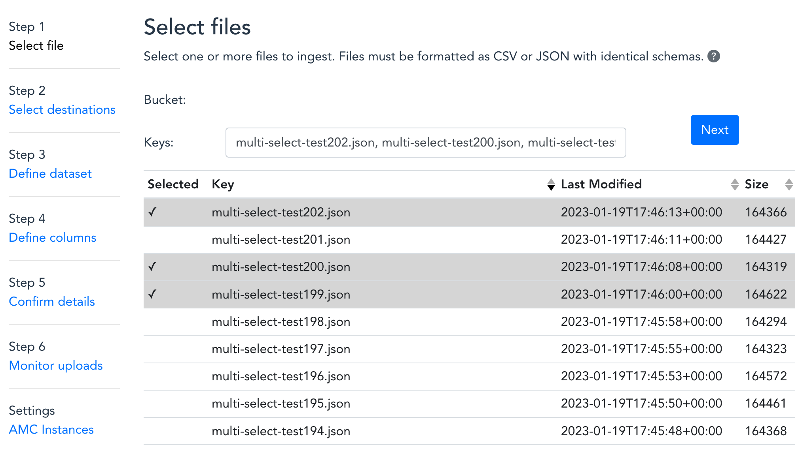

# Amazon Marketing Cloud (AMC) Uploader from AWS

This solution enables users to upload first party datasets from Amazon S3 into the Amazon Marketing Cloud (AMC). It includes a web application in which users are guided through the process of defining datasets and their PII attributes. Once this information is submitted, the solution initiates an ETL workflow that performs data normalization, hashing of plain-text PII, time-series partitioning, and upload to AMC.

## Architecture


The architecture diagram for this solution is shown above. The process flow is described below:

1. The user uploads first-party data to a designated S3 bucket.
2. The user logs into the provided web application.
3. Within the web application, the user selects a CSV or JSON file to upload and defines how the columns in that file should map to an AMC compatible schema.
4. Within the web application, the user can send dataset operations to one or more AMC Instances. This list of AMC Instances is saved in a system configuration table and can also be updated from the web application.
5. When the user submits their upload request, a dataset definition will be created in AMC and the ETL process will begin in AWS Glue.
6. The user-specified file is loaded into an AWS Glue job, where PII data is normalized and hashed, and timeseries records partitioned according to the data specifications provided by AMC.
7. The AWS Glue job outputs results in an AMC compatible format to Amazon S3. This event automatically triggers a request to AMC to begin uploading those results.
8. AMC asynchronously uploads the transformed data from Amazon S3.

If first-party data files have been encrypted using KMS, then users must specify which KMS key can be used to decrypt them. The CloudFormation parameter called "CustomerManagedKey" is provided for this purpose (see [below](#input)).

The dotted lines leading from the KMS key object in the architecture diagram indicate where this key is used for decryption. When users specify a KMS key, that key will be used to encrypt or decrypt data wherever it is saved or read from disk throughout the ETL pipeline, as described below:

* The Lambda function for the /get_data_columns API resource decrypts input files with the user-specified KMS key in order to render the web form in which users define dataset schemas.
* The Glue job decrypts input files with the user-specified KMS key in order to apply data transformations.
* The ETL Artifact Bucket performs server-side encryption to every object with the user-specified KMS key, or with a default key is none is provided.
* AMC encrypts datasets with the user-specified KMS key or with a default key is none is provided.

### User Interface:




## INSTALLATION

The following Cloudformation templates will deploy the application.

Region| Launch
------|-----
US East (N. Virginia) | [](https://console.aws.amazon.com/cloudformation/home?region=us-east-1#/stacks/new?stackName=amcufa&templateURL=https://solutions-reference.s3.amazonaws.com/amazon-marketing-cloud-uploader-from-aws/v1.0.0/amazon-marketing-cloud-uploader-from-aws.template)

Once the Cloud Formation stack has been created, open the URL shown in the `UserInterface` output of the base stack. You can also get this URL with the following AWS CLI command:

```
aws cloudformation --region $REGION describe-stacks --stack-name $STACK_NAME --query "Stacks[0].Outputs[?OutputKey=='UserInterface'].OutputValue" --output text
```

For more installation options, see the [Advanced Installation](#advanced-installation-options) section.

## INPUT

* *AdminEmail:* Email address of the administrator
* *DataBucketName:* Name of the S3 bucket from which source data will be uploaded.
* *AmcEndpointUrl:* API endpoint of the AMC instance. This can be located in the Instance Info page in the AMC UI.
* *DataUploadAccountId:* AWS account id that is connected to the AMC instance. This can be located in the Instance Info page in the AMC UI.
* *CustomerManagedKey:* (Optional) Customer Managed Key to be used for decrypting source data, encrypting ETL results, and encrypting the corresponding datasets in AMC

  * AMC provides the ability to encrypt customer datasets with encryption keys created in AWS Key Management Service (KMS). This step is optional. If an encryption key is not provided, AMC will perform default encryption on behalf of the customer. The benefit to using a customer generated encryption key is the ability to revoke AMC’s access to uploaded data at any point. In addition, customers can monitor encryption key access via AWS CloudTrail event logs.
  * To enable this feature, specify a key in the *CustomerManagedKey* CloudFormation parameter and modify the key's policy to grant usage permissions to the AMC instance, as described in the "KMS Encryption Key Usage" section of the AMC Data Upload documentation.

# Advanced Installation Options

## Building the solution from source code

The following commands will build the solution from source code.

```
EMAIL=[specify your email]
STACK_NAME=[specify a stack name]
REGION=[specify a region]
VERSION=0.0.0
PROFILE=default
git clone https://github.com/aws-solutions/amazon-marketing-cloud-uploader-from-aws
cd amazon-marketing-cloud-uploader-from-aws/deployment
DATETIME=$(date '+%s')
DIST_OUTPUT_BUCKET=amcufa-$DATETIME-dist
TEMPLATE_OUTPUT_BUCKET=amcufa-$DATETIME
aws s3 mb s3://$DIST_OUTPUT_BUCKET-$REGION --region $REGION
aws s3 mb s3://$TEMPLATE_OUTPUT_BUCKET --region $REGION
./build-s3-dist.sh --template-bucket ${TEMPLATE_OUTPUT_BUCKET} --code-bucket ${DIST_OUTPUT_BUCKET} --solution-name amcufa --version ${VERSION} --region ${REGION} --profile ${PROFILE} | tee >( grep TEMPLATE >template )
TEMPLATE=$(cat template | cut -f 2 -d "'")
```

Once you have built the demo app with the above commands, then it's time to deploy it.

#### Deploy

Use these commands to deploy the application in AWS CloudFormation:

```
AMC_INSTANCE_ID=[specify the id of your AMC instance]
TEMPLATE=[copy link shown at the end of the build script]
STACK_NAME=[arbitrary stack name]
EMAIL=[Email address to receive credentials for webapp]
SOURCE_BUCKET=[Name of the S3 bucket from which source data will be uploaded.]
AMC_ENDPOINT_URL=[Specify the API endpoint of your AMC instance]
DATA_UPLOAD_ACCOUNT_ID=[AWS account id that is connected to the AMC instance]
CUSTOMER_MANAGED_KEY=[(Optional) Customer Managed Key to be used for encryption]
PROFILE=[AWS profile for the AWS account that is connected to your AMC instance]

aws cloudformation create-stack --stack-name $STACK_NAME --template-url $TEMPLATE --region $REGION --parameters ParameterKey=AdminEmail,ParameterValue=$EMAIL ParameterKey=DataBucketName,ParameterValue=$SOURCE_BUCKET ParameterKey=AmcEndpointUrl,ParameterValue=$AMC_ENDPOINT_URL ParameterKey=DataUploadAccountId,ParameterValue=$DATA_UPLOAD_ACCOUNT_ID ParameterKey=CustomerManagedKey,ParameterValue=$CUSTOMER_MANAGED_KEY --capabilities CAPABILITY_IAM CAPABILITY_NAMED_IAM CAPABILITY_AUTO_EXPAND --profile $PROFILE --disable-rollback
```


# User Authentication

This solution uses [Amazon Cognito](https://docs.aws.amazon.com/cognito/index.html) for user authentication. When a user logs into the web application, Cognito provides temporary tokens that front-end Javascript components use to authenticate to back-end APIs in API Gateway and Elasticsearch. To learn more about these tokens, see [Using Tokens with User Pools](https://docs.aws.amazon.com/cognito/latest/developerguide/amazon-cognito-user-pools-using-tokens-with-identity-providers.html) in the Amazon Cognito documentation.

The front-end Javascript components in this application use the [Amplify Framework](https://docs.amplify.aws/) to perform back-end requests. You won't actually see any explicit handling of Cognito tokens in the source code for this application because that's all handled internally by the Amplify Framework.

## User account management

All the necessary Cognito resources for this solution are configured in the [deployment/auth.yaml](deployment/auth.yaml) CloudFormation template and it includes an initial administration account. A temporary password for this account will be sent to the email address specified during the CloudFormation deployment. This administration account can be used to create additional user accounts for the application.

Follow this procedure to create new user accounts:

1.	Sign in to the [Amazon Cognito console](https://console.aws.amazon.com/cognito/home).
2.	Choose Manage User Pools.
3.	In the User Pools page, select the user pool for your stack.
4.	From the left navigation pane, choose Users and Groups.
5.	On the Users tab, choose Create user.


6.	In the Create user dialog box, enter a username and temporary password.
7.	Choose Create user.
8.	On the User Pool page, under the Username column, select the user you just created.


9.	On the Users page, choose Add to group.
10.	In the Add user dialog box, access the drop-down list and select the user group corresponding to your auth stack.


The new user will now be able to use the web application.

## Unit Tests
---

The following steps can be done to run the unit tests contained in the `tests` directory:

1. Open a terminal window and navigate to the root directory.
2. Run this command in the terminal:
```shell
sh deployment/run-unit-tests.sh
```
3. A new virtual environment should now be created with the script with test environment variables. The tests will also execute.
4. A coverage report will be generated for SonarQube and can be viewed in the `tests/coverage-reports` directory.

### Pre-Commit
---

```
./run-pre-commit.sh --help
```


## Collection of operational metrics

This solution collects anonymous operational metrics to help AWS improve the
quality of features of the solution. For more information, including how to disable
this capability, please see the [implementation guide](https://docs.aws.amazon.com/solutions/latest/amazon-marketing-cloud-uploader-from-aws/collection-of-operational-metrics.html).


# Troubleshooting

## Why did so few identities resolve for my dataset?

AMC resolves identities by matching the hashed PII fields in advertiser data with hashed PII fields in Amazon Advertising data. In order for identities to match, advertisers must normalize PII fields prior to hashing in a way that is consistent with how Amazon normalizes PII fields. This solution attempts to normalize clear-text PII fields in a way that is consistent with Amazon Advertising, however it is possible for inconsistencies to be present.

If you see poor identity resolution results for data that you uploaded using this solution, then try using the AMC Data Uploader tool to normalize your data as described in the “AMC Data Upload Documentation [Beta].pdf” document and return to this solution to upload the hashed files output by that tool to AMC. You can download the “AMC Data Upload Documentation [Beta].pdf” document from the Documentation link shown on your AMC instance administration page.


# Uninstall

To uninstall the application, delete the CloudFormation stack, as described below. This will delete all the resources created for the application.

### Option 1: Uninstall using the AWS Management Console
1. Sign in to the AWS CloudFormation console.
2. Select your stack.
3. Choose Delete.

### Option 2: Uninstall using AWS Command Line Interface
```
aws cloudformation delete-stack --stack-name <installation-stack-name> --region <aws-region> --profile <profile>
```

# Known Issues

Visit the Issue page in this repository for known issues and feature requests.

# Contributing

See the [CONTRIBUTING](CONTRIBUTING.md) file for how to contribute.

# License

See the [LICENSE](LICENSE.txt) file for our project's licensing.

Copyright Amazon.com, Inc. or its affiliates. All Rights Reserved.

Unless required by applicable law or agreed to in writing, software distributed under the License is distributed on an "AS IS" BASIS, WITHOUT WARRANTIES OR CONDITIONS OF ANY KIND, either express or implied.
